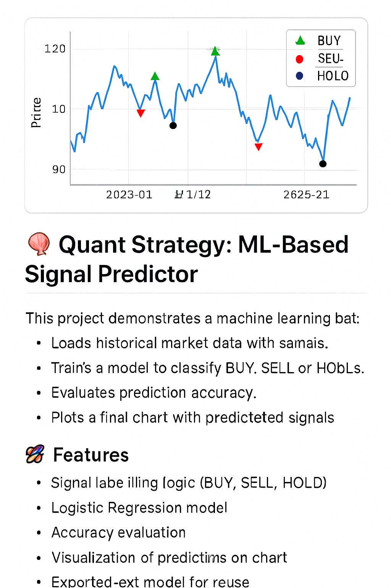

<p align="center">
  
</p>
# 🧠 Quant Strategy: ML-Based Signal Predictor

This project demonstrates a machine learning pipeline that:
- Loads historical market data with signals.
- Trains a model to classify BUY, SELL, or HOLD signals.
- Evaluates prediction accuracy.
- Plots a final chart with predicted signals.

## 🚀 Features
- Signal labeling logic (BUY, SELL, HOLD)
- Logistic Regression model
- Accuracy evaluation
- Visualization of predictions on chart
- Exported `.pkl` model for reuse

## 📊 Requirements
- Python 3.10+
- pandas
- scikit-learn
- matplotlib
- joblib

```bash
pip install -r requirements.txt
